# Hi there, I'm Yu-Tsen Wei. 👋

  
  
  

### 🚀 About Me
I am an **AI/ML Engineer** who builds software through AI-assisted, agentic development — pairing with LLM coding agents to design, implement, and ship projects end-to-end. My background is in **Deep Reinforcement Learning (DRL)** research, with a Master's degree from **National Yang Ming Chiao Tung University (NYCU)**.

- 🎓 **Master's Thesis:** *Risk-Aware Motorcycle Interaction in Mixed Traffic Flow via Deep Reinforcement Learning*.
- 🛠 **Expertise:** LLM-driven engineering workflows — directing AI coding agents to build and ship production software.
- 💡 **Passion:** Solving complex problems through practical, AI-accelerated software solutions.
- 🎌 **Current Focus:** AI/ML Engineering — designing and shipping software through AI coding agents.

---

### 🛠 Tech Stack

| Category | Tools & Languages |
| :--- | :--- |
| **Languages** | Python, C/C++, C#, JavaScript, SQL |
| **AI & Machine Learning** | Machine Learning, Deep Learning, Reinforcement Learning, PyTorch, TensorFlow |
| **AI-Assisted / Agentic Development** | Agentic AI Development, Local LLM, Claude Code, Codex, and other mainstream AI coding tools |
| **CS Fundamentals** | Software Engineering, Data Structures, Game Programming |
| **Environments & Cloud** | Unity 3D, Unity VR, AWS, Linux/Ubuntu, Git |
| **Certifications** | TOEIC 830, GPE Programming Certification |

### 📊 Languages Across My Projects

---

### 📊 Professional Highlights
- **AI Simulation:** Developed navigation models to simulate complex motorcycle behaviors in mixed traffic.
- **VR Development:** Core developer for a VR English learning system, optimizing rendering for high-frame-rate experiences.
- **Teaching:** Former TA for Data Structures and OOP (C++) at NYCU.

---

### 📫 Get in Touch
- **Email:** [frobel0520@gmail.com](mailto:frobel0520@gmail.com) 
- **Target Roles:** AI Engineer | Machine Learning Researcher | Software Development Engineer
